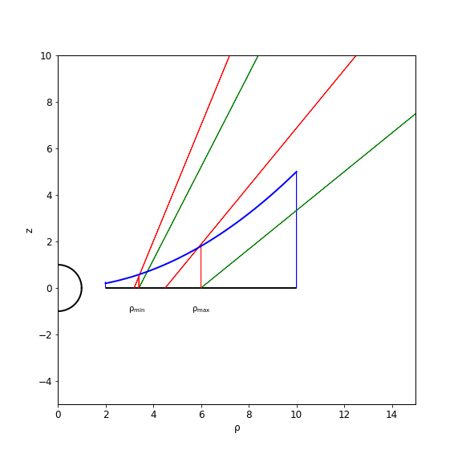

The Disk
########

The disk is normally treated as infinitely thin and defined by an inner boundary and an outer boundary.  It assumed to be in  Keplerian  rotation about 
the central object in the system.   The temperature distribution of the disk
is normally assumed to be that of a standard Shakura-Sunyaev disk, with a hard
boundary at its inner edge.   Options are provided for reading in a non-standard
temperature distribution.

An option is provide for a vertically extended disk, whose thickness increases
as with distance from the central object object.   

Vertically Extended disk (Details)
##################################

The figure above explains the basics issues associated with a vertically extended disk.  The wind emerges from the actual disk between :math:`\rho_{min}` and :math:`\rho_{max}`.  

In defining a vertically extended disk in the context of parameterized 
models, such as  KWD of SV, one needs to decide how to tranlated values from
a parameterized wind on a flat disk to a parameterized wind on verticallye extended
disk.   The choices we have made are (intended to be) as follows:

* The temperature and luminosity of a vertically extended disk are given by the distance from the central object in the disk plane. 
* The density at the base of the wind is defined as the same as the flat disk that underlies it.
* The poloidal  (and rotational) velocity at the footpoint is the poloidal velocity along the streamline, starting with :math:`v_{}` at the actual surface of the disk. 
* For the SV model, the streamline direction and velocity are determined by the distance from the central object along the disk plane.  This is not the same
  as one would obtain by projecting the streamline back to the disk plane.
* For the KWD disk,  stream line directions that reflect the focus position and the poloidal velocity ate taken from that expected by projecting 
  the stream line back to the disk plane.

(Note that the in the KWD case, there is a slight inconsistency/inaccuracy  in calculating desired mass loss rates, because the mass loss rate is calculate as if the disk
were flat, but the stream line directions are not exactly the same as due to the vertical extension of the disk.  There are also issues more generally because we do
not take into account the fact that the disk area of a vertically extended disk is not exactly the same as that of a flat disk.)
