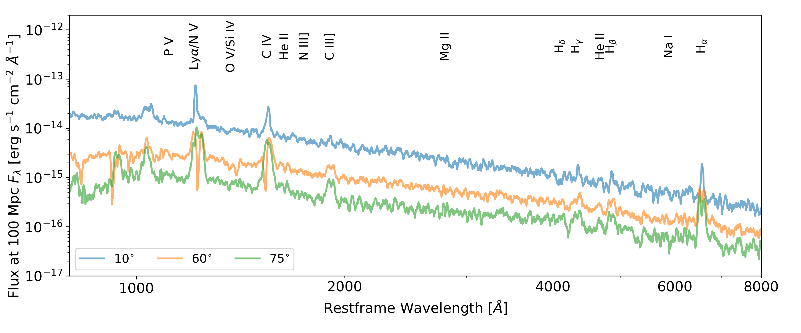
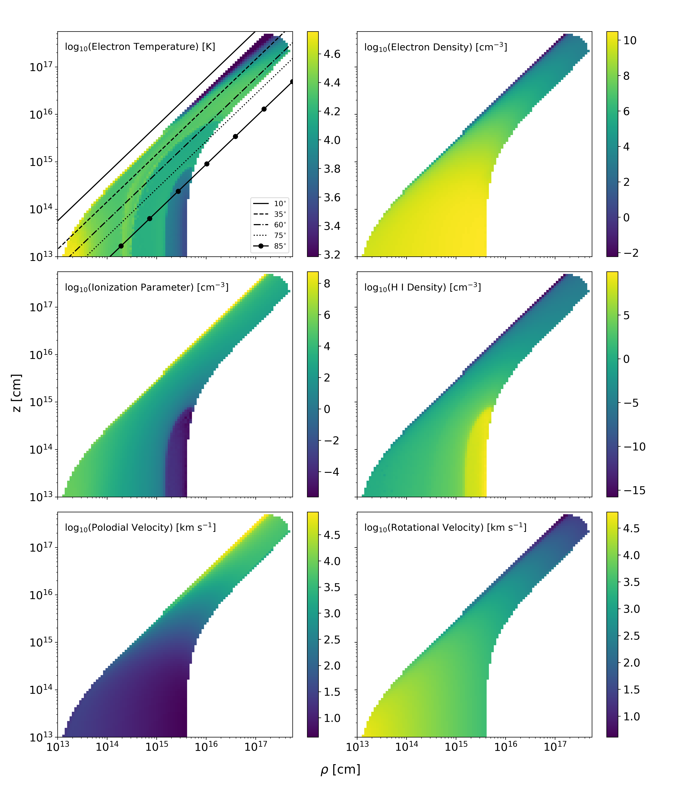

.. examples :

Demo: Tidal Disruption Event
############################

One of the recent applications of SIROCCO is modelling outflows in Tidal
Disruption Events (TDEs). We have explored how line formation in an accretion
disc wind could explain the BAL vs. BEL dichotomy observed in the UV spectra of
TDEs. We have also explored how reprocessing in an accretion disc wring could
give rise to the, at one point, unexpected optically bright TDEs.

We now describe a model used to simulate both the UV and optical features of
TDEs.

Model Setup
===========

Key Model Parameters
--------------------

We model a disc wind outflow using the kinematic
`Shlosman & Vitello (1993) <https://ui.adsabs.harvard.edu/abs/1993ApJ...409..372S/abstract>`_
(SV93) biconical disc wind model. This model has seen extensive use throughout the
history of SIROCCO to model across all length scales of accretion, from CVs to
QSO winds. Further information about the SV93 model can be found in the
documentation `here <../../sv.rst>`_.

The key parameters controlling the geometry and central object in this model
are as follows.

Schwarzschild black hole parameters:

.. math::

    \text{R}_{\text{disc, in}}   &=~10^{13} ~ \text{cm} \\
                                 &=~22.8 ~ \text{R}_{\text{g}} \\
    \text{R}_{\text{disc, out}}  &=~10^{15} ~ \text{cm} \\
                                 &=~2258 ~ \text{R}_{\text{g}} \\
    \text{M}_{\text{BH}}         &=~3 \times 10 \text{M}_{\odot} \\
    \dot{\text{M}}_{\text{disc}} &=~9.99 \times 10^{-3}~\text{M}_{\odot}~\text{yr}^{-1} \\
                                 &=~0.15~\dot{\text{M}}_{\text{Edd}}

Wind geometry parameters:

.. math::

    r_{\text{min}}        &=~10^{13} ~ \text{cm} \\
                          &=~22.8 ~ \text{R}_{\text{g}} \\
    r_{\text{max}}        &=~10^{15}~ \text{cm} \\
                          &=~2258 ~ \text{R}_{\text{g}} \\
    \alpha                &=~1.5 \\
    R_{v}                 &=~5 \times 10^{16} ~ \\
                          &=~1.13 \times 10^{5}~\text{R}_{\text{g}} \\
    \theta_{\text{min}}   &=~20^{\circ} \\
    \theta_{\text{max}}   &=~65^{\circ} \\
    \text{R}_{\text{max}} &=~5 \times 10^{17}~\text{cm} \\
                          &=~1.13 \times 10^{6}~\text{R}_{\text{g}} \\
    \gamma                &=~1 \\
    \lambda               &=~0 \\
    f_{v}                 &=~0.1 \\

For parameters controlling the radiative transfer and flow of SIROCCO, the
parameter file for this model can be found :download:`here <tde_fiducial.pf>`.

Radiation Sources
-----------------

There are two radiation sources in this model; the accretion disc and the wind
itself. Although, the wind does not act as a *net* source of photons, but rather
as a reprocessing medium. We assume that the wind is in radiative equilibrium
meaning any energy absorbed is reprocessed and re-radiated, i.e. via radiative
recombination. We treat the accretion disc as an ensemble of black bodies, using
a standard :math:`\alpha`-disc effective temperature profile
`(Shakura & Sunyaev, 1973) <https://ui.adsabs.harvard.edu/abs/1973A%26A....24..337S/abstract>`_.
The emergent SED is hence specified entirely by the mass accretion rate of
the accretion disc and the mass of the black hole.

The figure below shows the angle integrated SED for this model.

.. figure :: images/tde_sed.png
    :align: center

    The angle integrated accretion disc SED for the TDE model.

Runtime
=======

As the TDE outflow is optically thick, the model requires a fair amount of
computing power to be completed within a reasonable time frame. We ran this model
using two Intel Xeon Platinum 8160 processors with 24 processor cores each for a
total of 48 cores. Each processor core runs at a clock frequency of 2.1 GHz, with
a maximum boost clock of 3.7 GHz. The model uses roughly 70 GB of the available
DDR4 2666 MHz memory available in this system.

With this configuration using :math:`10^{8}` photons and SIROCCO's "-p 2" option
for logarithmic photon number stepping, the model takes roughly 10 ionization
cycles to converge in roughly 7.5 hours, or 360 total CPU hours. The spectral
cycles take a significantly longer time to complete. For six inclination angles and
:math:`10^{8}` photons, a single spectral cycle takes in excess of three hours.
However, with :math:`10^{6}` photons a spectral cycles takes roughly 100
seconds. We find that 5 - 10 spectral cycles with :math:`10^{6}` photons
result in reasonable sacrifice between noise in the final spectrum and the
run time of the spectral cycles.

Outputs
=======

Synthetic Spectra
-----------------

Below is a figure of three inclination angles of the emitted spectrum for this
model.

    Synthetic spectra of the TDE model for three inclination angles, as labelled
    in the lower left. The 60 :math:`^{\circ}` sight line is looking down, into, the
    wind, whereas both noth the 10 :math:`^{\circ}` and 75 :math:`^{\circ}` sight lines
    are not looking above and below the wind respectively. Important line
    transitions have been labelled at the top of the plot.

The model produces the strong resonance lines of N V, Si IV and C IV often seen
in UV spectra of TDEs and other objects with mildly ionized winds. We also
reproduce the BAL vs. BEL behaviour seen, as described in, i.e. `Parkinson et al. (2020) <https://ui.adsabs.harvard.edu/abs/2020MNRAS.494.4914P/abstract>`_,.
For inclinations which look into the wind, BALs are preferentially produced
and for inclinations looking above or below the wind, BELs are instead seen.

In the optical portion of the spectrum, the model produces broad recombination
emission features for the Balmer series of lines as well as for He II. These
features have extended red wings, clearest at low inclination angles. At intermediate
and high inclinations, the emission features are double peaked due to the high
rotational velocity of the wind near the base of the wind, where these features
are forming.

Physical Properties
-------------------

In the figure below, the physical properties of the outflow are shown.

    Contour plots of various physical parameters for the wind model, plotted on
    a log-log spatial scale. The top left panel shows which parts of the wind
    four inclination inclinations intersect.

At the base of the wind, the velocity is dominated by rotation. The rotational
velocity decreases with radius, due to conserving angular momentum. Far out in
the wind, the velocity is dominated by the polodial velocity, as set by the
velocity law in the model. The electron temperature and density are both greatest
at the base of the wind. The density decreases with radius, resulting in line
formation processes which scale with electron density, such as collisional
excitation, decreasing with radius also.

The outer top edge of the wind is cool, reaching temperature as low as
:math:`T_{e} \sim 10^{3}` K. SIROCCO does not implement any dust or molecular
physics, hence the treatment of this region of the wind is highly approximate.
However, since the line formation we are interested in does not occur in this
region, our neglect of this physics should not effect the emergency spectrum.

To measure the ionization state of the wind, we define the ionization parameter
:math:`U_{\text{H}}`,

.. math::

    U_{\text{H}} = \frac{4\pi}{n_{\text{H}}c} \int_{13.6 \frac{\text{eV}}{h}}^{\infty} \frac{J_{\nu}}{h\nu}~d\nu,

where :math:`\nu` denotes frequency, :math:`n_{\text{H}}` is the number density
of Hydrogen, :math:`h` is Planck's constant and :math:`J_{\nu}` is the monochromatic
mean intensity. The ionization parameter measures the ratio of the number density
of Hydrogen ionizing photons to the local matter density. For values of :math:`U_{\text{H}} > 1`,
Hydrogen is ionized making it a useful predictor of the global ionization state.
The ionization parameter is fairly constant throughout the wind with :math:`U_{\text{H}} \sim 10^{4}`,
indicating that the Hydrogen is ionized in much of the wind. At the very top of
the wind, the wind is highly ionized with :math:`U_{\text{H}} \sim 10^{8}`. There is,
however, a portion of the wind where :math:`U_{\text{H}} < 1`. This part of the wind
is at the base of the wind and large disc radii, :math:`\rho \sim 10^{15}` cm,
where Hydrogen is neutral. The density of neutral Hydrogen is, naturally, greatest
here with :math:`n_{\text{H I}} \sim 10^{7} ~ \text{cm}^{-3}` and is where the
majority of H :math:`\alpha` photons are emitted.

Files
=====

Attached below is the parameter file for the model and three spectrum files.

* :download:`tde_fiducial.pf <tde_fiducial.pf>`
* :download:`tde_fiducial.spec <tde_fiducial.spec>`
* :download:`tde_fiducial.log_spec <tde_fiducial.log_spec>`
* :download:`tde_fiducial.spec_tot <tde_fiducial.spec_tot>`
