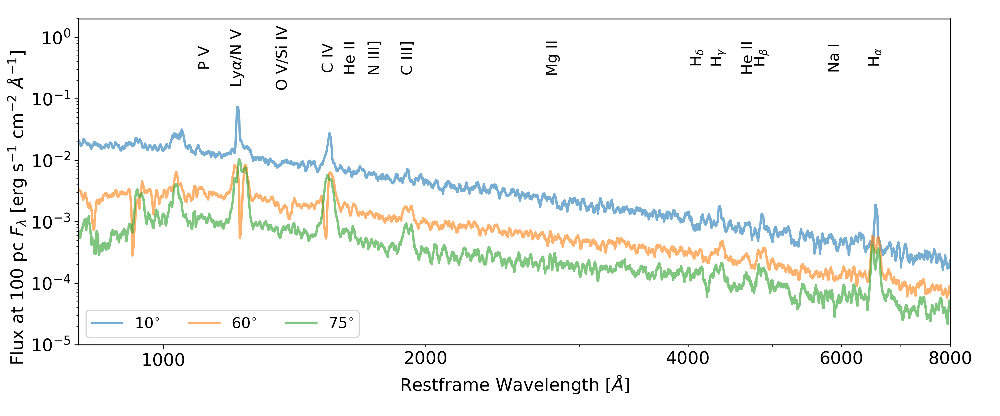

.. examples :

Demo: Tidal Disruption Event
############################

One of the recent applications of Python is modelling outflows in Tidal
Disruption Events (TDEs).

Model Setup
===========

Key Model Parameters
--------------------

We model a disc wind outflow using the kinematic `Shlosman & Vitello (1993) <https://ui.adsabs.harvard.edu/abs/1993ApJ...409..372S/abstract>`_
(SV93) biconical disc wind model. This model has seen extensive use throughout the
history of Python to model across all length scales of accretion, from CVs to
QSO winds. Further information about the SV93 model can be found in the
documentation `here <../../sv.rst>`_.

The key parameters controlling the geometry and radiative transfer in this model
are as follows,

.. code-block::

    Central_object.mass(msol)                    3e6
    Central_object.radius(cm)                    1e13
    Disk.type(none,flat,vertically.extended)        flat
    Disk.temperature.profile(standard,readin)       standard
    Disk.mdot(msol/yr)                    9.98e-03
    Disk.radmax(cm)     1e15
    Wind.dim.in.x_or_r.direction        100
    Wind.dim.in.z_or_theta.direction        100
    Wind.ionization(on.the.spot,ML93,LTE_tr,LTE_te,fixed,matrix_bb,matrix_pow)      matrix_pow
    Line_transfer(pure_abs,pure_scat,sing_scat,escape_prob,thermal_trapping,macro_atoms,macro_atoms_thermal_trapping)       macro_atoms_thermal_trapping
    Atomic_data     data/h20_hetop_standard80.dat
    Wind.mdot(msol/yr)                    2.99e-3
    SV.diskmin(units_of_rstar)      1
    SV.diskmax(units_of_rstar)                    377
    SV.thetamin(deg)        20
    SV.thetamax(deg)        65
    SV.mdot_r_exponent      0
    SV.v_infinity(in_units_of_vescape       1
    SV.acceleration_length(cm)      5e16
    SV.acceleration_exponent        1.5
    SV.v_zero_mode(fixed,sound_speed)       sound_speed
    SV.v_zero(multiple_of_sound_speed)      1
    SV.gamma(streamline_skew;1=usually)     1
    Wind.radmax(cm)     5e17
    Wind.filling_factor(1=smooth,<1=clumped)        0.1

.. todo :: Convert into something nicer to look at

Radiation Sources
-----------------

There are two radiation sources in this model; the accretion disc and the wind
itself. Although, the wind does not act as a *net* source of photons, but rather
as a reprocessing medium. We assume that the wind is in radiative equilibrium
meaning any energy absorbed is reprocessed and re-radiated, i.e. via radiative
recombination. We treat the accretion disc as an ensemble of black bodies, using
a standard :math:`\alpha`-disc effective temperature profile
`(Shakura & Sunyaev, 1973) <https://ui.adsabs.harvard.edu/abs/1973A%26A....24..337S/abstract>`_.
The emergent SED is hence specified entirely by the mass accretion rate of
the accretion disc and the mass of the black hole.

The figure below shows the angle integrated SED for this model.

.. figure :: images/tde_sed.png
    :align: center

    The angle integrated accretion disc SED for the TDE model.

Runtime
=======

As the TDE outflow is optically thick, the model requires a fair amount of
computing power to be completed within a reasonable time frame. We ran this model
using two Intel Xeon Platinum 8160 processors with 24 processor cores each for a
total of 48 cores. Each processor core runs at a clock frequency of 2.1 GHz, with
a maximum boost clock of 3.7 GHz. The model uses roughly 70 GB of the available
DDR4 2666 MHz memory available in this system.

With this configuration, the model takes roughly 10 ionization cycles to converge
in roughly 7.5 hours, or 360 total CPU hours, with :math:`10^{8}` photons and
Python's "-p 2" option for logarithmic photon number stepping. The spectral
cycles take a significantly longer time than the ionization cycles. With
:math:`10^{8}` photons, a single spectral cycle can take in excess of 12 hours
to complete. However, with :math:`10^{6}` photons, the cycles take roughly 100
seconds each. We find that 5 - 10 spectral cycles with :math:`10^{6}` photons
result in reasonable low noise spectra.

Outputs
=======

Synthetic Spectra
-----------------

    Synthetic spectra of the TDE model for three inclination angles, as labelled
    in the lower left. The 60 :math:`^{\circ}` sight line is looking down, into, the
    wind, whereas both noth the 10 :math:`^{\circ}` and 75 :math:`^{\circ}` sight lines
    are not looking above and below the wind respectively. Important line
    transitions have been labelled at the top of the plot.

Physical Properties
-------------------

.. figure:: images/tde_wind.png
    :align: center

    Contour plots of various physical parameters for the wind model, plotted on
    a log-log spatial scale. The top left panel shows which parts of the wind
    four inclination inclinations intersect.

Files
=====

Attached below is the parameter file for the model and three spectrum files.

* :download:`tde_fiducial.pf <tde_fiducial.pf>`
* :download:`tde_fiducial.spec <tde_fiducial.spec>`
* :download:`tde_fiducial.log_spec <tde_fiducial.log_spec>`
* :download:`tde_fiducial.spec_tot <tde_fiducial.spec_tot>`
