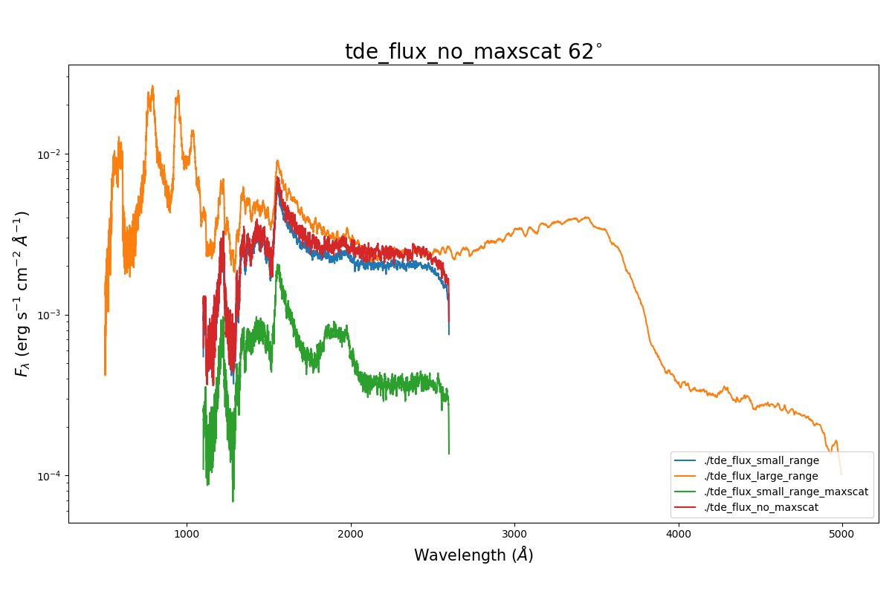

Issues with Generating Spectra
##############################

With the current machinery to create spectra, it is possible to come across the
situation where models with large optical depth or wind velocities will generate
spectra with different flux normalisation depending on the wavelength range.

This problem was originally encountered whilst modelling Tidal Disruption Events.
Two spectra for the same model were generated over two wavelength ranges; a
restricted (1100 - 2600 A) and a broader (500 - 5000 A) range. The problem
encountered was that the broad range spectrum had *more* flux than the spectrum
with the restricted range. The figure below shows the same model, but over two
wavelength ranges - as well as two spectra where the maximum number of scatters
a photon can undergo is changed,

* **tde_flux_small_range:** The restricted wavelength range
* **tde_flux_large_range:** The broad wavelength range
* **tde_flux_small_range_maxscat:** The restricted wavelength range with a value :code:`MAXSCAT = 50`
* **tde_flux_no_maxscat:** The restricted wavelength range with no :code:`MAXSCAT` limit

   Example spectra showing differing flux totals

The problem here is not caused by a bug with the code, but is a consequence of
the large wind velocities and optical depths of the model. We currently believe
that there are two reasons why the flux differs between these two wavelength ranges.

Doppler Shifting out of the Spectrum Wavelength Range
=====================================================

At the edges of the restricted spectrum above, the flux is reduced. This is
due to photon frequencies being shifted outside of the wavelength range of the
spectrum. If a significant number of photons are removed from the spectrum
in this way, then the following Error is printed,

.. code ::

   spectrum_create: Fraction of photons lost: 0.10 wi/ freq. low, 0.19 w/freq hi

This tells one the fraction of the photon sample which does not contribute towards
the spectrum due to to the photon frequencies being larger or smaller than the
defined spectrum range, due to Doppler shifting. In models with large wind
velocities (0.2 - 0.5 c) and a small spectral range, the fraction of photons lost
is large and the flux at the edge of generated spectra is reduced - as can be
seen above in the above figure. However, when the wind has a more moderate velocity,
the number of photons lost due to being shifted out of the range is much lower and
does not produce a noticeable effect on the flux normalisation of the spectra.

Removing Photons due to Too Many Scatters
=========================================

As well as edge effects, flux can be lost due to photons being removed from the
photon sample due to scattering too many times. In SIROCCO, when a photon has undergone
`MAXSCAT = 500` scatters, a photon is assumed to have become stuck in the wind
and hence it is terminated and no longer tracked.

In models with large optical depths, the number of photons terminated in this way
can become large. During spectrum generation, these photons will never fully
escape the system but will only contribute partially to the spectrum due to
extract - they will never contribute if Live or Die is used instead.

At current, there is no logic to detect this and hence no error is given. However,
it is often insightful to read the output from the `Photons contribution to the
various spectra` table, as shown below,

.. code::

   Photons contributing to the various spectra
   Inwind   Scat    Esc     Star    >nscat    err    Absorb   Disk    sec    Adiab(matom)
        0       0    3455       0       0       0       0       0       0       0
        0       0    3455       0       0       0       0       0       0       0
        0       0     427       0       0       0       0       0       0       0
        0       0    1598       0       0       0       0       0       0       0
        0       0    1430       0       0       0       0       0       0       0
        0       0       0       0       0       0       0       0       0       0
        0       0    3313       0   17209       0     169       0       0       0
        0  282914  487831    1474       0       0     129  223605       0       0
        0  441756  336514    2223       0       0     135  215325       0       0
        0  609395  180082    5677       0       0      94  200705       0       0
        0  750672   61308   12010       0       0      59  171904       0       0
        0  838923   26143   29057       0       0      55  101775       0       0

In the above table, one can see that 17,209 photons which scattered more than
``MAXSCAT`` times contributed to the the scattered spectrum, suggesting that a large
number of photons were terminated due to too many scatters.

.. note::

   The photon numbers presented in this table are only for the master MPI process. Hence, if
   running in multiprocessor mode, the number here will never equal the total
   number of photons in the simulation, but only the number of photons in the current
   process.

GitHub Issue
============

The original **GitHub** issue discussing this problem can be found here; :issue:`471`.
