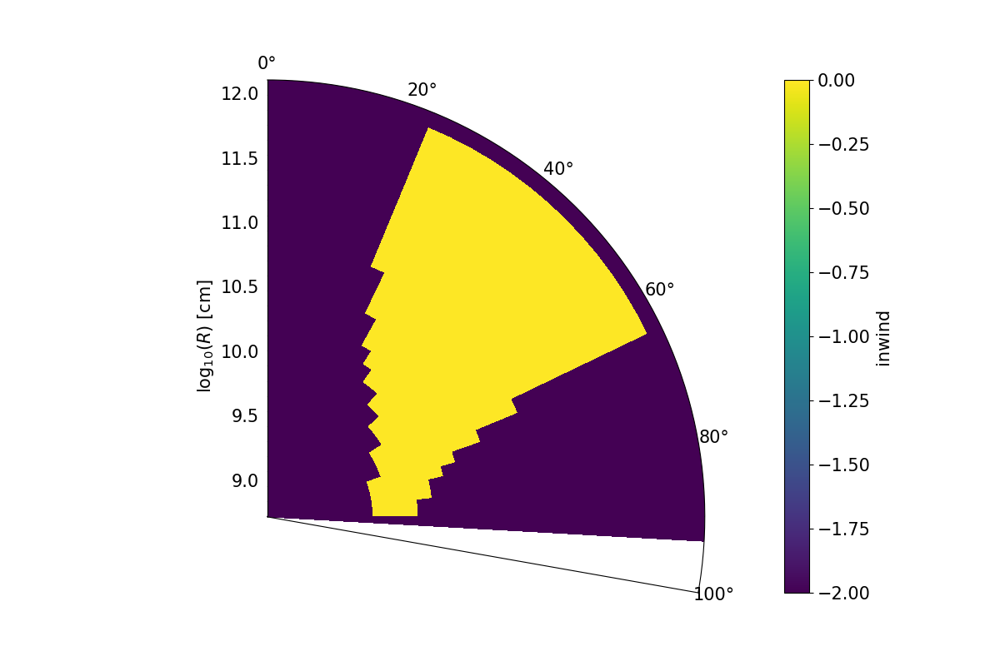
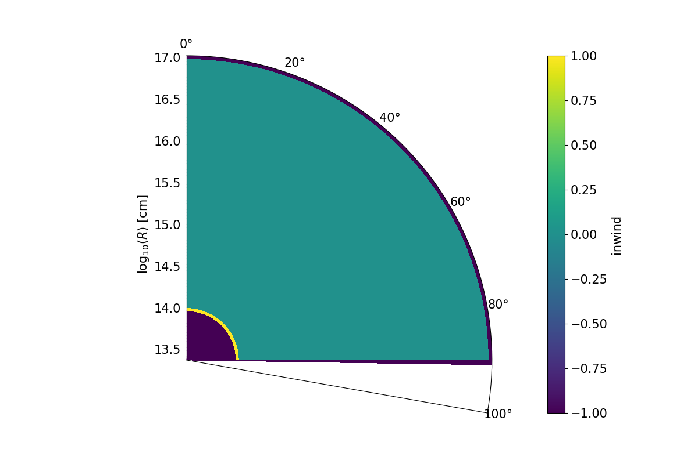

.. imported:

Importing Models
################

SIROCCO can read 1D or 2.5D grids of density and velocity, instead of setting up
the model from an analytic prescription. Caution should be exercised with this
mode, as it is still in a development phase, and the mode requires the user to
ensure that things like mass and angular momentum conservation are enforced.

This mode is activated via wind type option "imported", which triggers an extra
question, e.g.

.. code::

   Wind.type(SV,star,hydro,corona,kwd,homologous,shell,imported)             imported
   Wind.coord_system(spherical,cylindrical,polar,cyl_var)          cylindrical
   Wind.model2import                    cv.import.txt

An example in cylindrical geometry, :code:`cv_import.pf`, is given with a
supplementary grid file in :code:`examples/beta/`.
The format expected in the grid input file for such a cylindrical model is as
follows, although the column headers lines are actually not read.

.. code::

   i  j  inwind    x      z     v_x   v_y   v_z     rho   t_e    t_r
   -- -- ------  -----  -----  ----- ----- -----   ----- -----  -----
   0  0    -1    1.4e9  3.5e9   0.0   0.0   6e5     0.0   0.0    0.0
   0  1     0    1.4e9  3.5e10  1e5   0.0   2e6     1e9   0.0    0.0

where all physical units are CGS. i and j refer to the rows and
columns of the wind cells respectively, while inwind tells the code whether
the cell is in the wind (:code:`0`), or out of the wind (:code:`-1`). If a
partially in wind flag is provided (:code:`1`), the code defaults to treating
this cell as not in the wind. This could in principle be adapted, but means that
for the moment this mode is most useful when using models with sufficiently high
resolution or covering factors that partially in wind cells are unimportant.

The other input files have slightly different formats.  The best way to see the
format is use the process described at the end of the page.

Creating your own model
=======================

In order to create your own model, there are a few important things to consider:

* all units should be CGS (except for indices and flags, which are integers)
* x and z for cylindrical (or r and theta for spherical polar) coordinates are
  supplied at the edges, rather than centres, of cells. Thus, a given cell is
  described by the location of it's bottom left hand corner in (x,z) space.
* Ghost cells **must** be included. This means that additional rows and columns
  of cells must be included at the edges of the grid, and they must be excluded
  from the wind so that their temperatures and densities are set to zero, but
  have a velocity that SIROCCO can interpolate with.
* i and j correspond to rows and columns respectively, so that the first row of
  cells at the disk plane has i = 0.
* rho the density of the cell in cgs units
* The t_e and t_r columns are optional and correspond to the electron and
  radiation temperature

Although :code:`cv_import.pf` is designed to closely match the
:code:`cv_standard.pf` model, it does not match the model perfectly as
the imported model does not deal with 'partially in wind' cells. As such,
we generally recommend imported models are used for either wind models
that entirely fill the grid or that have sufficiently high resolution
that the partial filled cells are relatively unimportant.

Spherical Grids
---------------

Using a spherical coordinate system, a 1D spherically symmetric model can be
read into SIROCCO.

To read in a grid of this type, the following columns are required for each cell:

* i                        :  the element number for each cell
* :math:`r`                :  the radial coordinate in CGS
* :math:`v_{r}`            :  the radial velocity in CGS
* :math:`\rho`             :  the mass density in CGS
* :math:`T_{e}` (optional) :  the electron temperature in Kelvin
* :math:`T_{r}` (optional) :  the radiation temperature in Kelvin

.. admonition :: Grid Coordinates

    The radial coordinates of the cells must be constantly increasing in size.

Cylindrical Grids
-----------------

Using cylindrical coordinates, a 2.5D model can be read into SIROCCO.

.. admonition :: Grid Coordinates

    Note that the grid coordinates and the velocity is specified in Cartesian
    coordinates.

To read in a grid of this type, the following columns are required for each cell:

* i                        :  the i element number (row)
* j                        :  the j element number (column)
* inwind                   :  a flag indicating whether the cell is in the wind or not
* :math:`x`                :  the x coordinate in CGS
* :math:`z`                :  the z coordinate in CGS
* :math:`v_x`              :  the velocity in the x direction in CGS
* :math:`v_y`              :  the velocity in the y direction in CGS
* :math:`v_z`              :  the velocity in the z direction in CGS
* :math:`\rho`             :  the mass density in CGS
* :math:`T_{e}` (optional) :  the electron temperature in Kelvin
* :math:`T_{r}` (optional) :  the radiation temperature in Kelvin

.. admonition :: Unstructed/non-linear Grids

    In principle, it is possible to read in an unstructured or non-linear
    cylindrical grid, i.e. where the cells are not regularly spaced, however,
    SIROCCO has been designed for structured grids with regular grid spacing, and
    as such there may be undefined behaviour for unstructured grids.

Polar Grids
-----------

Using polar coordinates, a 2.5D model can be read into SIROCCO.

.. admonition :: Cartesian Velocity

    The velocity in for the polar grid is required to be in Cartesian
    coordinates due to conventions within the SIROCCO programming style. As such,
    any polar velocity components must first be projected into their Cartesian
    equivalent.

* i                        :  the i element number (row)
* j                        :  the j element number (column)
* inwind                   :  a flag indicating whether the cell is in the wind or not
* :math:`r`                :  the radial coordinate in CGS
* :math:`\theta`           :  the :math:`\theta` coordinate in degrees
* :math:`v_x`              :  the velocity in the x direction in CGS
* :math:`v_y`              :  the velocity in the y direction in CGS
* :math:`v_z`              :  the velocity in the z direction in CGS
* :math:`\rho`             :  the mass density in CGS
* :math:`T_{e}` (optional) :  the electron temperature in Kelvin
* :math:`T_{r}` (optional) :  the radiation temperature in Kelvin

.. admonition :: :math:`\theta`-cells

    The :math:`\theta` range should extend from at least 0 to 90°. It is
    possible to extend beyond 90°, but these cells should not be inwind and
    should be reserved as ghost cells.

Setting Wind Temperatures
-------------------------

Reading in a temperature is optional when importing a model. However, if one
temperature value for a cell is provided, then SIROCCO assumes that this is
the electron temperature and the radiation temperature will be initialised as,

.. math ::
    T_{r} = 1.1 T_{e}.

However, if two temperature values are provided for the cells, then the first
temperature will be assumed as being the electron temperature and the second
will be the radiation temperature.

If no temperature is provided with the imported model, then the radiation
temperature will be initialised using the parameter, e.g.,

`Wind.t.init 40000`

The electron temperature is then initialised using the Lucy approximation,

.. math ::
    T_{e} = 0.9 T_{r}

Ghost Cells and Setting Values for `inwind`
-------------------------------------------

The `inwind` flag is used to mark if a grid cell is either in the wind or not
in the wind. The following enumerator flags are used,

.. code :: c

    W_IGNORE      = -2   // ignore this grid cell
    W_NOT_INWIND  = -1   // this cell is not in the wind
    W_ALL_INWIND  =  0   // this cell is in the wind

Whilst it is possible to set in `inwind = 1` for a grid cell, that is that the
cell is partially in the wind, SIROCCO will instead set these cells with
`inwind = -2` and ignore these grid cells.

Spherical
^^^^^^^^^

Three guard cells are expected. One guard cell is expected at the inner edge of
wind and two are expected at the outer edge of the wind. Guard cells should still
have a velocity, but the mass density and temperatures should be zero.

Cylindrical
^^^^^^^^^^^

For cylindrical grids, the outer boundaries of the wind should have two layers
of  guard cells in the same way as the a spherical grid, as above. For these
cells, and all cells which do not make up the wind, an inwind value of -1 or -2
should be set.

.. figure:: ../images/import_cylindrical_inwind.png
    :width: 700px
    :align: center

    A colour plot of the inwind variable for the cv_standard.pf example. Here, a
    SV model is being imposed on a cylindrical coordinate grid.

Polar
^^^^^

For polar grids, the outer boundaries of the wind should have two layers of
guard cells in the same way as the a spherical grid, as above. For these cells,
and all cells which do not make up the wind, an inwind value of -1 or -2 should be set.

In this example, the theta cells extend beyond 90°. But, as they are not inwind,
SIROCCO is happy to include these cells. For a stellar wind in polar coordinates,
these extra :math:`\theta` cells extending beyond 90° are required.

    A colour plot of the inwind variable for the rtheta.pf example. Here, a SV
    model is being imposed on an polar coordinate grid.

    A colour plot of the inwind variable for a stellar wind imposed on a polar
    coordinate grid. Important to note is the "halo" of inwind = -1 cells
    surrounding the inwind cells. The cells with inwind = 1 will be set to
    inwind = -2 when imported into SIROCCO and ignored.

Maximum and Minimum Wind Radius
--------------------------------

The maximum and minimum spherical extent of the wind is calculated automatically
by SIROCCO, and does not take into account guard cells when it is doing this.

Generating example inputs for testing and familiarizing oneself with SIROCCO's import capability
===============================================================================================

If one is trying to use the import capability of SIROCCO for the first time,
it will be useful to familiarize oneself with the process, and the file format
for a particular coordinate system, by running first running SIROCCO on a model
that is something similar to model to be imported, but which takes advantage of
one of the kinematic models available with the code.

For example, suppose you have a hydrodynamical simulation of an AGN wind which
is in polar coordinates and you want to use SIROCCO to calculate the spectrum.
Then you might create a model of an AGN with a similar coordinate system using,
say, a Knigge Wood & Drew wind (and similar atomic data).
For specificity, suppose this model has the root name "test"

Once you have run the model, you can create an import file file by first running
the routine :code:`windsave2table`, or more specifically:

.. code:: bash

   windsave2table test

This produces a large number of ascii tables, which are described elsewhere

In the py_progs directory, you will find 3 scripts, :code:`import_1d.py`,
:code:`import_cyl.py` and :code:`import_rtheta.py`, which will convert one of
the output files :code:`test.0.master.txt` to an import file, :code:`test.import.txt`,
that can be used with the import mode of SIROCCO. The 3 different routines are
for 1d spherical coordinates, and polar (r-theta) coordinates respectively.

Assuming the py_progs directory is in your PATH, and given that our example is
for cylindrical coordinates, one would run:

.. code:: bash

   import_cyl.py test

At that point, you can test this import file, by modifying the first .pf file to
import mode (imported). Running SIROCCO on this file, will result in your being
asked the name of the import file, and give you a "baseline" to import the
hydrodynamical simulation to work.

Note that one should not assume that spectra produced by the original run of
SIROCCO and the run of the imported model will be identical. There are several
reasons for this:

First, in creating the original model, SIROCCO accounts for the possibility that
some cells are partially in the wind. This is not possible in the imported
models. Only cells that are complete in the wind are counted.

Second, within SIROCCO, positions and velocities are assumed defined at the
corners of cells, whereas densities are assumed to be cell centered. If one
provides a table where all of the quantities are at the same exact position
(namely density is at the same position as x), there will be a slight
discrepancy between the way in model as calculated internally and as represented
within SIROCCO.
