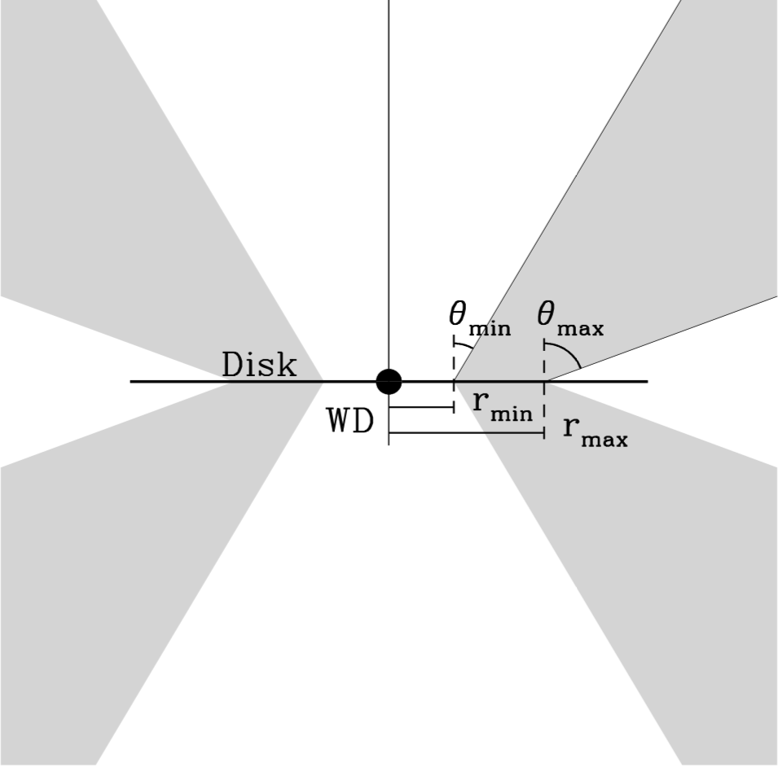

SV93 biconical wind prescription
########################################################

In the `SV93 <https://ui.adsabs.harvard.edu/abs/1993ApJ...409..372S/abstract>`_ prescription, the wind emerges between :math:`r_{min}` and 
:math:`r_{rmax}` along streamlines whose orientation with respect to the system 
are described an angle

.. math::
    \theta = \theta_{min} + (\theta_{max} - \theta_{min}) x^{\gamma}

where 

.. math::
    x=\frac{r_o - r_{min}}{r_{max}-r_{min}}

and :math:`r_o` refers to the footpoint of a streamline.

    The geometry of a Shlosman & Vitello wind
    

The poloidal velocity along the streamlines is defined to be

.. math::
    v_l = v_o + (v_{\infty}(r_o)-v_o) \frac {(l/R_v)^{\alpha}}{(l/R_v)^{\alpha}+1}

The scale length :math:`R_v` and the exponent :math:`\alpha` control the
acceleration of the wind between a velocity :math:`v_o`, at the base of the wind 
and the terminal velocity :math:`v_{\infty}(r_o)`. The initial velocity :math:`v_o`
can be set to either a constant, normally 6 km/s, or a multiple of the sound-speed 
at the streamline base. The terminal velocity of each streamline varies
depending on the location of the streamline in the inner and outer disk, being
characterized as a fixed multiple of the escape velocity at the footpoint of the
streamline. Thus the poloidal velocity is greatest for stream lines that originate 
from the inner regions of the disk, since the gravitational potential that
must be overcome is greatest there.

The mass loss per unit surface area :math:`\delta \dot{m}/\delta A` of the disk is
controlled by a parameter :math:`\lambda` such that

.. math::        
    \frac{\delta\dot{m}}{\delta A} \propto \dot{m}_{wind} r_o^{\lambda} cos(\theta(r_o))

With this prescription, the overall mass loss rate declines with
radius if :math:`\lambda` is somewhat less than -2.

To use the SV93 prescription, therefore, one must provide the
basic parameters of the system, the mass of the WD, the accretion
rate, the inner and outer radius of the disk, and in addition, for
the wind :math:`\dot{m}_{wind}`, :math:`r_{min}`, :math:`r_{max}`, :math:`\theta_{min}`,
:math:`\theta_{max}`, :math:`\gamma`, :math:`R_{\nu}`, :math:`\alpha`, :math:`\lambda`, and the
multiple of the escape velocity to be used for :math:`v_{\infty}`.

The following variables are used::

    Wind.mdot(msol/yr)                         1e-9
    SV.diskmin(units_of_rstar)                 4
    SV.diskmax(units_of_rstar)                 12
    SV.thetamin(deg)                           20
    SV.thetamax(deg)                           65
    SV.mdot_r_exponent                         0
    SV.v_infinity(in_units_of_vescape          3
    SV.acceleration_length(cm)                 7e10
    SV.acceleration_exponent                   1.5
    SV.gamma(streamline_skew;1=usually)         1
    SV.v_zero_mode(fixed,sound_speed)                  fixed 
    SV.v_zero(cm/s)                                                6e5

